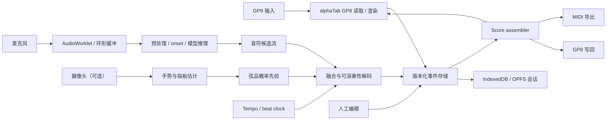

# 系统架构

## 1. 架构目标

架构必须允许音频模型、手势模型、弦品解码器、渲染器和导出器分别替换。实时系统的难点不只是推理，而是多个延迟不同、可能撤回结论的数据源如何形成稳定乐谱。因此核心不是某个神经网络，而是带修订语义的事件流。

## 2. 推荐形态

首版采用 Web/PWA + Web Worker/AudioWorklet；Python 仅承担研究基线和可选本地推理服务。这样可以最早复用 alphaTab、浏览器音视频 API 和本地存储，并保留后续 Tauri 包装的路径。



## 3. 模块职责

### 3.1 `apps/web`

- 设备与权限管理；
- AudioWorklet 采集、重采样、环形缓冲与背压；
- 摄像头预览和显式校准；
- 录制、编辑、回放、诊断 UI；
- alphaTab 渲染与光标；
- 会话持久化与导入/导出编排。

### 3.2 `packages/contracts`

只放稳定、无框架依赖的契约：

- `SessionConfig`、`InstrumentProfile`；
- `AudioChunkRef`、`GesturePrior`；
- `NoteCandidate`、`NoteEvent`、`TabPosition`；
- `Revision`、`CommitBoundary`、`ScoreSnapshot`；
- `DiagnosticEvent` 与 schema 版本迁移。

所有跨 Worker、跨语言或落盘数据先经过 JSON Schema/二进制协议验证。

### 3.3 `services/transcription`

- Basic Pitch、TabCNN 或后续模型的离线基线；
- 数据预处理、评估和模型导出；
- 可选 WebSocket/本地 sidecar 流式服务；
- 不承担产品会话的唯一持久化。

### 3.4 `Score assembler`

把时间连续的音符事件变成小节、拍、voice、duration、tie 和技法。它负责：

1. 保留原始秒时间；
2. 对可量化副本进行节拍对齐；
3. 处理跨拍/跨小节延音；
4. 按确认线生成稳定快照；
5. 向渲染器和导出器提供同一规范对象。

### 3.5 alphaTab 与 GP8 适配层

alphaTab 负责 GP8 输入、显示和播放，但不直接充当编辑历史，也不被视作现成的 GP8 writer。适配层需要：

- `alphaTab.Score ↔ CanonicalScore` 的显式映射；
- 不支持字段和降级行为报告；
- 小节级脏标记与节流重渲染；
- GP8 导入后立即规范化，写回前重新验证；
- 将 alphaTab 升级限制在独立 PR，并运行全部黄金文件。

GP8 写回由独立 `Gp8Writer` 接口承担。第一垂直切片只要求 GP8 输入；写回必须以 Guitar Pro 8 重新打开和语义比对为验收，不能仅凭扩展名或旧版 exporter 判断兼容。

## 4. 建议的数据模型

```ts
type EventState = 'candidate' | 'provisional' | 'committed' | 'locked' | 'rejected';

interface NoteEvent {
  id: string;
  sessionId: string;
  startSeconds: number;
  endSeconds: number;
  midiPitch: number;
  velocity?: number;
  cents?: number;
  quantized?: {
    bar: number;
    beat: number;
    tick: number;
    durationTicks: number;
  };
  tab?: {
    string: number;
    fret: number;
    confidence: number;
    alternatives: Array<{ string: number; fret: number; score: number }>;
  };
  confidence: number;
  state: EventState;
  source: 'audio' | 'gesture' | 'fusion' | 'import' | 'user';
  revision: number;
  lockedFields: string[];
}
```

正式实现必须用 schema 而不是直接复制此草案；时间单位、弦编号方向和 tick 分辨率需要在 `TAB-101` 中冻结。

## 5. 流式与修订策略

### 5.1 窗口

- 采集块：128–1024 samples，由浏览器与设备决定；
- 推理窗：候选 1–4 秒，带 50%–75% overlap；
- 合并窗：依据 onset 距离、音高、能量和模型置信度去重；
- 修订窗：最近 1–2 小节；
- 确认线：修订窗之前或用户手动确认处。

### 5.2 去重与撤回

相邻窗口输出不能直接 append。事件合并器要为同一 note 建立稳定 ID，并产生 `insert/update/retract/commit` 操作。UI 只消费操作流，不自行猜测事件身份。

### 5.3 背压与降级

若推理落后：

1. 保证音频落盘和事件时钟；
2. 降低渲染频率；
3. 跳过非关键视觉帧；
4. 增大推理 hop 或切到轻量模型；
5. 明确显示“分析延迟”，不可静默丢块。

## 6. 弦品解码与手势融合

对于 MIDI 音高 `p`，标准调弦中的合法位置满足 `p = openStringPitch[s] + fret + capo`。候选评分建议分解为：

```text
score = audio_confidence
      + λ1 * gesture_log_probability
      - λ2 * hand_span_cost
      - λ3 * position_shift_cost
      - λ4 * string_crossing_cost
      - λ5 * impossible_chord_penalty
      + λ6 * fingering_style_prior
```

先实现可解释的动态规划/束搜索，再比较神经 MIDI-to-Tab 解码器。手势必须是软先验：遮挡、相机抖动或校准失效时，其权重自动降低。所有输出都要通过硬约束校验，确保音高与弦品一致。

## 7. 文件策略

### 7.1 内部会话

建议是版本化 manifest + 事件日志 + 可选媒体引用：

```text
session.tabrecord/
  manifest.json
  events.ndjson
  revisions.ndjson
  score.snapshot.json
  media/                可选；默认可外置
  diagnostics.json
```

实现时可打包为 zip，但不要把 GP8 或 MIDI 作为恢复会话所需的唯一文件。

### 7.2 Guitar Pro 8

- 唯一兼容边界是 GP8 `.gp`；不实现其他 Guitar Pro 版本的独立适配器；
- 输入是 P0：通过 alphaTab 读取 GP8，并转换为页面模型；
- 写回在输入模型稳定后实现：从当前页面快照生成 GP8 `.gp`；
- 每次输入和写回都生成 compatibility report，列出丢失或降级字段；
- GP8 写回必须由 Guitar Pro 8 重开和语义 diff 验证。

### 7.3 MIDI

MIDI 只表达演奏事件，不能完整保存吉他弦品、排版和所有技法。导出时应同时允许保存 TabRecord 会话或 GP8 文件。

## 8. 安全与隐私

- 音频/视频权限按需请求，并在录制期间持续显示状态；
- 摄像头帧默认只在本机内存处理，不持久化；
- 诊断日志不包含原始媒体或可逆音频特征；
- 导入文件视为不可信输入，限制大小、解压比例、解析时间和 worker 内存；
- 模型文件校验 hash，禁止运行不受信任的动态代码。

## 9. 测试架构

- **单元测试**：事件合并、量化、弦品候选、修订状态机；
- **属性测试**：任意合法调弦下，`pitch == open + fret + capo`；
- **黄金文件**：小型 GP8/MIDI 文件输入 → 规范化 → 写回 → 由 GP8 再打开；
- **离线基准**：固定音频和 JAMS/MIDI/TAB 标注；
- **实时基准**：虚拟音频设备重放，记录 capture/inference/render 时间戳；
- **失败注入**：设备断开、模型超时、后台标签页、存储配额不足；
- **视觉回归**：固定尺寸下的 TAB SVG/截图。

## 10. 部署演进

1. 静态 Web/PWA + 浏览器本地推理；
2. 可选本地 Python sidecar，用于较重模型和实验；
3. 如确有需求，再设计云端推理和账号体系；
4. Tauri/桌面壳只在设备兼容、文件系统和低延迟证据充分后引入。
